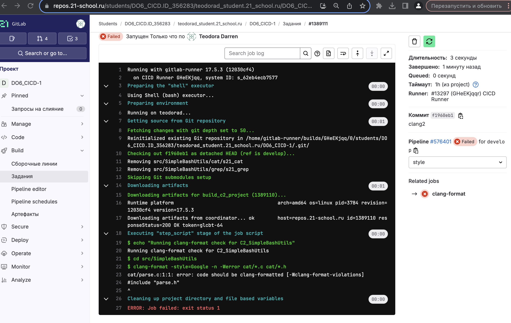
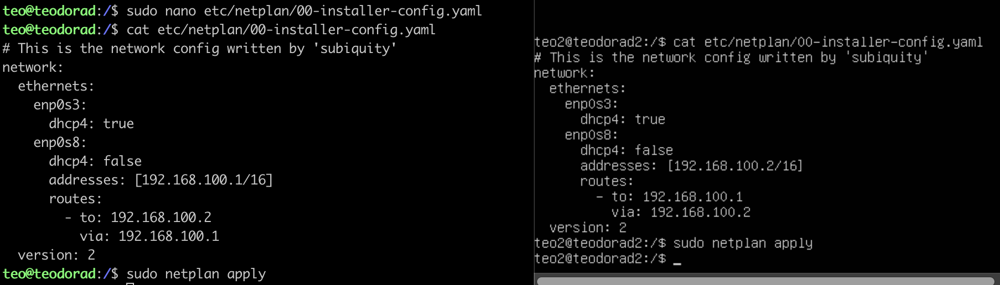

# Basic CI/CD

**CI/CD** — это набор принципов и практик, которые позволяют чаще и надежнее развертывать изменения программного обеспечения.   
**CI/CD** pipeline — это последовательность действий (скриптов) для определенной версии кода в репозитории, которая запускается автоматически при совершении изменений.  
### Основы **CI**
**CI** (Continuous Integration) — в дословном переводе «непрерывная интеграция».
Имеется в виду интеграция отдельных кусочков кода приложения между собой.
**CI** обычно выполняет две задачи, описанные далее.
- BUILD
    - Проверяем, собирается ли вообще код;
    - Готовим артефакты для следующих стадий.
- TEST
    - Тесты кодстайла;
    - Модульные тесты;
    - Интеграционные тесты;
    - Прочие тесты, которые у тебя есть;
    - Отчеты о тестах.
### Основы **CD**
**CD** (Continuous Delivery) — это расширение непрерывной интеграции, поскольку оно автоматически развертывает все изменения кода в тестовой и/или производственной среде после этапа сборки.
**CD** может выполнять задачи, описанные далее.
- PUBLISH (в случае применения докера для развёртывания):
    - Собираем образы контейнеров;
    - Пушим образы туда, откуда их будем потом брать для развертывания.
- UPDATE CONFIGS:
    - Обновляем конфигурацию на машинах.
- DEPLOY STAGING:
    - Развертывание тестовой среды для ручных тестов, QA, и прочих неавтоматизируемых проверок;
    - Может запускаться как вручную, так и автоматически при успешном прохождении стадий CI.
- DEPLOY PRODUCTION:
    - Разворачиваем новую версию системы на «продакшн»;
    - Этот этап желательно запускать вручную, а не автоматически;
    - По желанию можно настроить только для определенной ветки репозитория (master, release и т. п.).  


> Проброс портов порт хоста 2022, порт гостя 22, внутренняя сеть  
> Внутри виртуалке `sudo apt update`  и `sudo apt install openssh-server`  
>ssh teo@localhost -p 2022  


### Part 1. Настройка **gitlab-runner**
- Подними виртуальную машину *Ubuntu Server 22.04 LTS*.
- Скачай и установи на виртуальную машину **gitlab-runner**.  
> `curl -L "https://packages.gitlab.com/install/repositories/runner/gitlab-runner/script.deb.sh" | sudo bash`  
> `sudo apt install gitlab-runner`  
  

>> make, gcc, clang нужно скачать на машину  

- Запусти **gitlab-runner** и зарегистрируй его для использования в текущем проекте (*DO6_CICD*).  
> Для регистрации понадобятся URL и токен, которые можно получить на страничке задания на платформе.
>   
> проверка активности:
>   

### Part 2. Сборка
> копируем проект C2_SimpleBashUtils в src наешго проекта  
- Напиши этап для **CI** по сборке приложений из проекта *C2_SimpleBashUtils*.
- В файле _gitlab-ci.yml_ добавь этап запуска сборки через мейк файл из проекта _C2_.  
- Файлы, полученные после сборки (артефакты), сохрани в произвольную директорию со сроком хранения 30 дней.  
  
> .yaml файл  

  
> Pipeline Passed  

  
> artifacts

### Part 3. Тест кодстайла
- Напиши этап для **CI**, который запускает скрипт кодстайла (*clang-format*).
    
- Если кодстайл не прошел, то «зафейли» пайплайн.
- В пайплайне отобрази вывод утилиты *clang-format*.
  
- Исправляем ошибки  
    

### Part 4. Интеграционные тесты

- Напиши этап для **CI**, который запускает твои интеграционные тесты из того же проекта.  
  
- Запусти этот этап автоматически только при условии, если сборка и тест кодстайла прошли успешно.
- Если тесты не прошли, то «зафейли» пайплайн.
- В пайплайне отобрази вывод, что интеграционные тесты успешно прошли / провалились.  
  

### Part 5. Этап деплоя
> Подними вторую виртуальную машину *Ubuntu Server 22.04 LTS*.  
> Напиши этап для **CD**, который «разворачивает» проект на другой виртуальной машине.  
> Запусти этот этап вручную при условии, что все предыдущие этапы прошли успешно.  
> Напиши bash-скрипт, который при помощи **ssh** и **scp** копирует файлы, полученные после сборки (артефакты), в директорию */usr/local/bin* второй виртуальной машины.  
> В файле _gitlab-ci.yml_ добавь этап запуска написанного скрипта.  
> В случае ошибки «зафейли» пайплайн.  

- 1)Поднимаем вторую машину. Пропишем дополнительные адреса на машинах  
> Изменяем `etc/netplan/00-installer-config.yaml`  
> не забываем `sudo netplan apply`  

> настрокий виртуал бокса:
>> первая машина:
>>   
>>   
>>   
>> вторая машина:
>>   
>>   
> проверка соединения
>   
> 

- 2)Сгенерируем на первой машине ssh ключ и скопируем на вторую машину  
> не забываем на второй машине скачать ssh: `sudo apt-get update` и `sudo apt-get install openssh-server`  
> Генерируем ключ `sudo su gitlab-runner` и `ssh-keygen -t rsa -b 2048`  
   
> Копируем на 2 машину `ssh-copy-id teo2@192.168.100.2`  
   
>> `scp` (Secure Copy) — это команда для безопасного копирования файлов между локальной и удаленной машинами по протоколу SSH. Она обеспечивает шифрование передаваемых данных, что делает процесс безопасным.  
> Так же даем доступ второй машине `sudo chmod -R 777 /usr/local/bin/`  
   


>>Как происходит перенос ?
>>Сначала мы хотим разрешить первой машине использовать команды без запроса пароля у второй машины. Делаем это следующим образом:
>>- `sudo su - gitlab-runner` (почему с gitlab-runner? Все артефакты лежат там и это является нашей рабочей директорией)
>>- `ssh-keygen -t rsa -b 2048`.  -t: Этот параметр определяет тип генерируемого ключа. В данном случае он используется для указания алгоритма, который будет использоваться для получения ключа. rsa: Это тип генерируемого ключа, которым является RSA (Rivest-Shamir-Adleman). RSA - это широко используемый алгоритм шифрования с открытым ключом.
>>- `ssh-copy-id teo2@10.10.0.2` - Команда ssh-copy-id используется для копирования локального открытого ключа SSH на удаленный сервер и настройки удаленного сервера на принятие ключа для аутентификации.
>>При запуске ssh-copy-id teo2@10.10.0.2 команда выполняет следующие действия:  
>> Ищет локальный открытый ключ SSH в расположении по умолчанию, обычно ~/.ssh/id_rsa.pub.  
>> Подключается к удаленному серверу с помощью SSH и копирует открытый ключ на удаленный сервер.  
>> Добавляет открытый ключ к файлу ~/.ssh/authorized_keys удаленного сервера.  
>> Устанавливает правильные разрешения для каталога ~/.ssh и файла authorized_keys.  


- 3)Изменяем .yaml файл - добавдяем этап CD  
  

- 4)Создаем скрипт  


- В результате ты должен получить готовые к работе приложения из проекта *C2_SimpleBashUtils* (s21_cat и s21_grep) на второй виртуальной машине.  
  

> Сохрани дампы образов виртуальных машин.

### Part 6. Дополнительно. Уведомления
- Настрой уведомления об успешном/неуспешном выполнении пайплайна через бота с именем «[твой nickname] DO6 CI/CD» в *Telegram*

- Создаем нового бота в канале @BotFather  
    

- Узнаем ID пользователя в канале @userinfobot  
    

- Создаем скрип telegram.sh (берем пример из materials)  
    

- Добавляем после каждого этапа в gitlab-ci.yml  
```
  after_script:
    bash src/tg_bot.sh
```  
  

- Текст уведомления должен содержать информацию об успешности прохождения как этапа **CI**, так и этапа **CD**.  
     